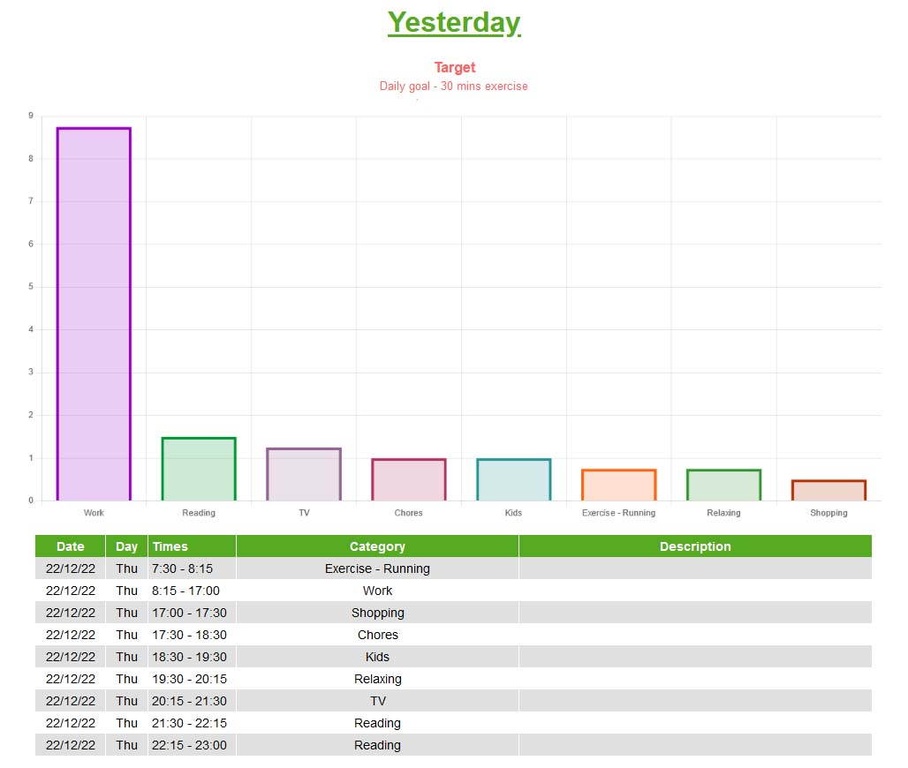
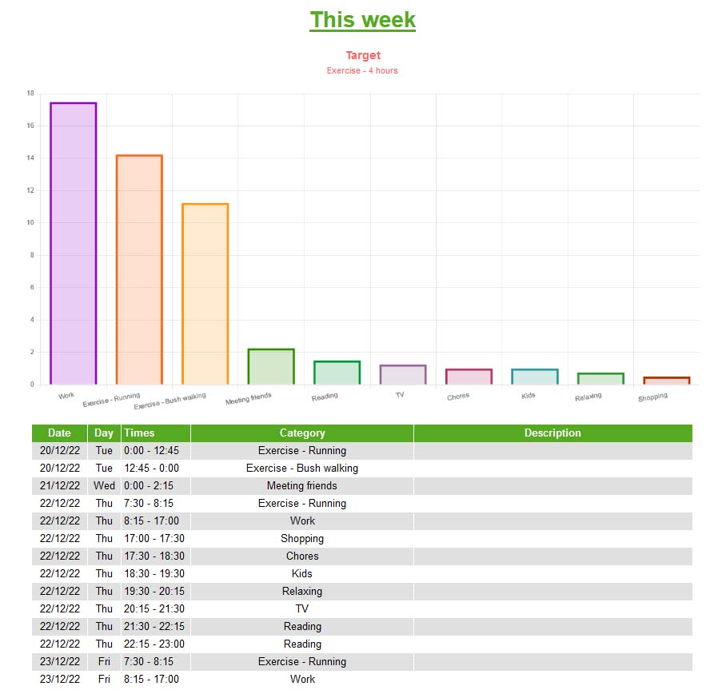

# Time logger

A timelogging app to help you see where you spend your time in various areas of your life.
If you record every single thing you do in the day, for a month, you can see where you are wasting time and what you should be doing more of.
You can set up any category. There are categories such as Work, Exercise, Socialize so you can see how long your are spending on each category.

Graphs let you see a clear picture of where you spend your time.

You can have as many sections as you want. You set the start and end date eg start of the month and end of the month. You can set goals for each section.

